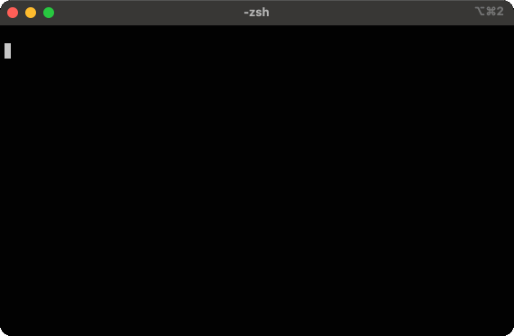

# Laplacian filters benchmark

This project aims to compare the performance of different implementations of the Laplacian filter (edge detection).

## DataSet

The [test pictures](./pictures/) are from the [BSDS500 dataset](https://www2.eecs.berkeley.edu/Research/Projects/CS/vision/bsds/). 

We used the grayscale versions and converted them into [_portable graymap format_](https://en.wikipedia.org/wiki/Netpbm) (.pgm) to keep the implementation simple, including with languages such as Mojo 🔥 where there is no utility libraries yet.

Some scripts use the [inline image protocol](https://iterm2.com/documentation-images.html) offered by iTerm2 to make the user experience more interactive. This also helped us during the development phase to quickly detect implementation errors. 

A subset of the dataset can be viewed using the ```viewpic.py```  or ```viewpic.mojo``` scripts.


## Installation

### Python

Python implementations have been tested with version 3.11.1. You can install the dependancies with pip
```sh
cd python; pip install -r requirements.txt
```

### Mojo 🔥

⚠️ The Mojo implementations have been tested with the pre-release of mojo version 0.7.0. Mojo is moving [fast](https://docs.modular.com/mojo/changelog.html) : you may encounter malfunctions if you try to use it with a newer version. I plan to follow up quickly the syntax updates.

You can follow [the instructions](https://docs.modular.com/mojo/manual/get-started/) to install mojo compiler on Ubuntu linux or MacOs. There is no external dependancies.

## How to run the benchmark

### Interactive mode

It is possible to interactively test each implementation, for example:

```sh
cd python; python naive.py
```



Likewise, it is possible to test interactively mojo implementations :

```sh
cd mojo; mojo naive.mojo
```


### Benchmark mode

Interactive mode works on a subset of the dataset and the display of images may influence the results. The script `run.sh` allows you to run the battery of tests in batch mode on all the dataset (except the first 3 slowest python implementations) :

```sh
./run.sh
```


## Results

Here are the results on my laptop (apple macbook M1 first generation) :

```sh
 % ./run.sh
PLATFORM : arm/macOS-14.2.1-arm64-arm-64bit with 8 cpus
---   compute mean duration on the BSDS500 dataset  ---
PYTHON : naive implementation          : 493.112 ms / picture
PYTHON : numpy element wise product    : 268.995 ms / picture
PYTHON : numpy + numba jit             : 43.958 ms / picture
PYTHON : scipy.signal fftconvolve      : 2.389 ms / picture
PYTHON : scipy.ndimage convolve        : 0.840 ms / picture
PYTHON : scipy.ndimage laplace         : 0.675 ms / picture
PYTHON : opencv filter2D               : 0.358 ms / picture
PYTHON : opencv laplacian              : 0.374 ms / picture
MOJO🔥 : naive implementation          : 0.80776999999999999 ms / picture
MOJO🔥 : vectorized implementation     : 0.23050999999999999 ms / picture
MOJO🔥 : parallelized (2 workers)      : 0.17534 ms / picture
```
## 

No living animals were harmed during these experiments.